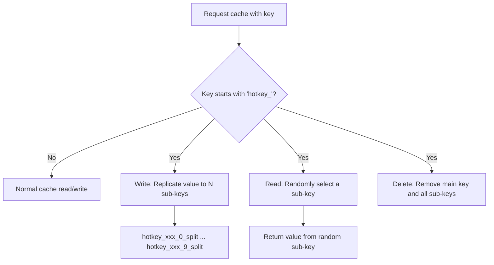

# Workflow: Symfony Cache HotKey Bundle

```mermaid
flowchart TD
    A[Request cache with key] --> B{Key starts with 'hotkey_'?}
    B -- No --> C[Normal cache read/write]
    B -- Yes --> D[Write: Replicate value to N sub-keys]
    D --> E[hotkey_xxx_0_split ... hotkey_xxx_9_split]
    B -- Yes --> F[Read: Randomly select a sub-key]
    F --> G[Return value from random sub-key]
    B -- Yes --> H[Delete: Remove main key and all sub-keys]
```

## 说明

- 当 key 以 `hotkey_` 开头时，写入会分片到多个子 key，读取时随机读取一个子 key，删除时清理全部相关 key。
- 非热点 key 走正常缓存逻辑。
- 该流程保证热点数据分布均匀，提升高并发场景下的缓存性能。
